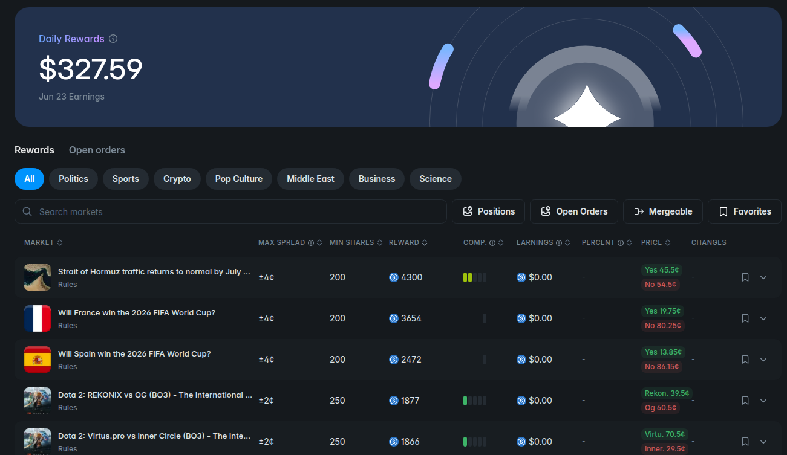

# Polymarket Market-Making Bot

> **Language / 语言:** **English** · [简体中文](README.md)
>
**Official Website**: [polypulse.wiki](https://polypulse.wiki/)

Automated market-making on Polymarket liquidity rewards—place orders to earn rewards and manage the full order lifecycle.


## Quick Start

**No Python required.** Download the archive for your platform, extract, and run.

| Platform | Archive | Contents |
|----------|---------|----------|
| Windows | `windows.zip` | `main.exe`, `orderbook.exe`, `.env.example` |
| Linux | `linux.zip` | `main`, `orderbook`, `.env.example` |
| macOS(Intel) | `macos.zip` | `main`, `orderbook`, `.env.example` |

### 1. Extract

Extract to any folder. Keep all three files in the **same directory**. The programs will create `logs/` and `data/` (SQLite cache) there automatically.

### 2. Configure

```bash
# Copy the template (on Windows, copy and rename to .env in File Explorer)
cp .env.example .env
```

Edit `.env` and set at least:

```bash
POLYMARKET_PRIVATE_KEY=your_private_key
POLYMARKET_PROXY_ADDRESS=your_proxy/deposit_wallet_address
```

Tune other parameters as needed; see `.env.example` for bilingual comments.

### 3. Start

**Start the orderbook service first, then the main bot** (keep both terminals/windows open).

**Windows (cmd or PowerShell):**

```bat
orderbook.exe
main.exe
```

**Linux / macOS:**

```bash
chmod +x orderbook main    # first run may require this
./orderbook
./main
```

### 4. Stop

Press `Ctrl+C` in each terminal. The main program will attempt to cancel active orders on exit.

---

> The sections below cover source install and building from scratch. If you use the binary packages above, skip **Requirements** and **Installation** and go to **Configuration** to tune parameters.

## Features

- **Automatic market selection**: Scan liquidity-reward markets and rank by reward ratio
- **Orderbook data service**: Periodically fetch orderbooks into local SQLite cache—no Redis
- **CLOB V2 compatible**: Uses `py-clob-client-v2` with POLY_1271 deposit wallets (`SIGNATURE_TYPE=3`)
- **Smart quoting**: Place orders at reward-range boundaries to maximize reward eligibility
- **Automatic order management**:
  - Replenish orders after fills
  - Hedge sells immediately after buy fills
  - Adjust prices in real time to stay at range boundaries
- **Risk controls**: Per-market exposure limits
- **Cross-platform**: Run from source or as single-file binaries on Windows / Linux / macOS

## Architecture

```
┌─────────────────────────────────────────────────────────┐
│              Main program (main.py / poly-mm)            │
│  - Market scan & selection                               │
│  - Order management (CLOB V2)                            │
│  - Main loop                                             │
└─────────────────────────────────────────────────────────┘
         │                    │                    │
         ▼                    ▼                    ▼
┌──────────────┐    ┌──────────────┐    ┌──────────────┐
│ Market Mgr   │    │ Order Mgr    │    │ Risk Mgr     │
│              │    │              │    │              │
│ - Scan       │    │ - Place/cancel│   │ - Exposure   │
│ - Filter     │    │ - Replenish  │    │ - Limits     │
│ - Reward ratio│   │ - Hedge/adjust│   │              │
└──────────────┘    └──────────────┘    └──────────────┘
         │                    │
         ▼                    ▼
┌─────────────────────────────────────────────────────────┐
│   Orderbook service (start_orderbook_service.py /        │
│                    poly-orderbook)                       │
│  - Periodic liquidity-reward market scan                 │
│  - Batch HTTP fetch from Polymarket                      │
│  - Write to SQLite cache                                 │
└─────────────────────────────────────────────────────────┘
         │
         ▼
┌─────────────────────────────────────────────────────────┐
│   Local cache (redis_orderbook_client.py → SQLite)       │
│   Default: data/orderbook_cache.sqlite3                  │
└─────────────────────────────────────────────────────────┘
```

## Project Layout

| File | Description |
|------|-------------|
| `main.py` | Main market-making program |
| `start_orderbook_service.py` | Orderbook service entry script |
| `orderbook_data_service.py` | Market scan & orderbook update logic |
| `order_manager.py` | Place, cancel, replenish, hedge |
| `market_manager.py` | Market scan & filtering |
| `market_making_strategy.py` | Strategy & pricing |
| `api_client.py` | Polymarket REST / CLOB client |
| `http_orderbook_client.py` | Batch orderbook fetch over HTTP |
| `redis_orderbook_client.py` | Local KV cache (SQLite backend; name kept for compatibility) |
| `config.py` | Load all settings from `.env` |
| `runtime_paths.py` | Path resolution for source vs packaged builds |
| `.env.example` | Config template (bilingual comments) |
| `poly_market_making.spec` | PyInstaller spec |
| `build.sh` / `build.bat` | Build scripts for Linux/macOS / Windows |

## Requirements

- Python 3.10+
- Network access to Polymarket APIs
- **No** Redis or other external database

## Installation

### 1. Clone

```bash
git clone <repository-url>
cd poly_Market-making
```

### 2. Virtual environment

```bash
python3 -m venv venv
source venv/bin/activate   # Linux / macOS
# or
venv\Scripts\activate      # Windows
```

### 3. Dependencies

```bash
pip install -r requirements.txt
```

Key packages:

- `py-clob-client-v2` — Polymarket CLOB V2 SDK
- `httpx[socks]` — HTTP client (SOCKS / HTTP2)
- `python-dotenv` — `.env` loading
- `requests` — REST requests

### 4. Configuration

All settings live in `.env` (**`config.yaml` is no longer used**):

```bash
cp .env.example .env
```

**Minimum required:**

```bash
POLYMARKET_PRIVATE_KEY=your_private_key_here
POLYMARKET_PROXY_ADDRESS=your_proxy_wallet_address_here
```

**Common strategy settings:**

```bash
MAX_MARKETS=5
ORDER_SIZE_MULTIPLIER=1.0
MAX_EXPOSURE_PER_MARKET_USDC=20
MIN_REWARD_RATIO=0

SIGNATURE_TYPE=3   # POLY_1271 deposit wallet / V2 (typical for new accounts after 2026)
CHAIN_ID=137

ORDERBOOK_TTL=300
ORDERBOOK_DB_PATH=          # empty = data/orderbook_cache.sqlite3
```

See [`.env.example`](.env.example) for the full list.

## Usage

### 1. Start orderbook service (recommended)

Scans markets and writes orderbooks to SQLite for the main program.

**Foreground:**

```bash
python start_orderbook_service.py
```

**Background (Linux / macOS only):**

```bash
python start_orderbook_service.py --daemon
```

> `--daemon` uses `os.fork` and is not available on Windows. Use Task Scheduler or `Start-Process` instead.

### 2. Run main program

```bash
python main.py
```

**Other modes:**

```bash
python main.py --stop       # Cancel all buy orders and exit
python main.py --daemon     # Background (Linux / macOS)
```

The main program will:

1. Initialize API, strategy, and order components
2. Cancel existing buy orders (strategy requirement)
3. Scan and filter opportunity markets
4. Place orders on selected markets
5. Enter main loop: check orders, adjust prices, periodic rescan

### 3. Graceful shutdown

Press `Ctrl+C` or send `SIGTERM` to cancel active orders, print stats, and exit.

## Building Executables

PyInstaller produces single-file binaries for deployment without Python.

### Build

Run on **each target platform** (no cross-compilation):

```bash
# Linux / macOS
bash build.sh

# Windows
build.bat
```

Output in `dist/`:

| Build artifact | Source script | Role |
|----------------|---------------|------|
| `poly-orderbook` | `start_orderbook_service.py` | Orderbook service |
| `poly-mm` | `main.py` | Main bot |

### Release packaging

Rename and zip for distribution (matches **Quick Start**):

| Platform | Archive | Rename |
|----------|---------|--------|
| Windows | `windows.zip` | `poly-orderbook.exe` → `orderbook.exe`, `poly-mm.exe` → `main.exe` |
| Linux | `linux.zip` | `poly-orderbook` → `orderbook`, `poly-mm` → `main` |
| macOS | `macos.zip` | same as Linux |

Each zip: **orderbook binary + main binary + `.env.example`**. Users copy to `.env` and add keys.

Local test:

1. Put binaries and `.env` in one folder
2. Start orderbook, then main
3. Logs, `data/`, and `.env` are resolved relative to the executable (`runtime_paths.py`)

### Build privacy

PyInstaller may embed build-machine paths or usernames. For public releases, build in a neutral directory (e.g. `/tmp/build`) or CI (e.g. GitHub Actions).

## Workflow

### Market selection

1. Fetch all liquidity-reward markets
2. Filter by volume, spread, reward size, etc. (`.env`)
3. Read orderbooks (SQLite cache first; HTTP fallback)
4. Compute reward range, competition, reward ratio
5. Sort by ratio; take top `MAX_MARKETS`

### Order management

1. **Initial quotes**: Buy/sell at reward-range boundaries
2. **Monitoring**: Detect fills/cancels; replenish; hedge after buys
3. **Price adjustment**: Re-quote when boundaries move
4. **Market refresh**: Rescan; quote new markets; cancel exited ones

## Configuration Reference

Settings use **uppercase env vars** in `.env`. Common items below; full list in `.env.example`.

### Account & trading

| Variable | Description | Example |
|----------|-------------|---------|
| `POLYMARKET_PRIVATE_KEY` | Wallet private key (required) | — |
| `POLYMARKET_PROXY_ADDRESS` | Deposit/proxy wallet (required) | `0x...` |
| `SIGNATURE_TYPE` | `3` = POLY_1271 deposit wallet / V2 | `3` |
| `CHAIN_ID` | Chain ID | `137` (Polygon) |

### Strategy

| Variable | Description | Default |
|----------|-------------|---------|
| `MAX_MARKETS` | Max markets to make | `20` |
| `ORDER_SIZE_MULTIPLIER` | Order size multiplier | `2.0` |
| `MAX_EXPOSURE_PER_MARKET_USDC` | Max exposure per market (USDC) | `100` |
| `MIN_REWARD_RATIO` | Min reward ratio threshold | `0.01` |
| `MIN_PROFIT_MARGIN_BPS` | Min hedge profit (bps) | `5` |

### Main loop intervals

| Variable | Description | Default |
|----------|-------------|---------|
| `UPDATE_INTERVAL_SECONDS` | Market rescan interval (s) | `300` |
| `ORDER_CHECK_INTERVAL_SECONDS` | Order check interval (s) | `30` |
| `ORDERBOOK_UPDATE_INTERVAL_SECONDS` | Price adjust interval (s) | `5` |
| `PRICE_DEVIATION_THRESHOLD_BPS` | Re-quote threshold (bps) | `1` |

### Orderbook service

| Variable | Description | Default |
|----------|-------------|---------|
| `ORDERBOOK_SERVICE_ENABLED` | Enable orderbook service | `true` |
| `ORDERBOOK_SERVICE_MARKET_SCAN_INTERVAL` | Market scan interval (s) | `300` |
| `ORDERBOOK_SERVICE_ORDERBOOK_UPDATE_INTERVAL` | Orderbook update interval (s) | `30` |
| `ORDERBOOK_TTL` | Cache TTL (s) | `300` |
| `ORDERBOOK_DB_PATH` | SQLite path (empty = default) | — |

## Logs

Logs under `logs/YYYY-MM-DD/` by module, e.g.:

- `logs/2026-06-22/main.log`
- `logs/2026-06-22/order_manager.log`
- `logs/2026-06-22/market_manager.log`
- `logs/2026-06-22/orderbook_data_service.log`

## Notes

1. **Key security**: Never commit `.env`; ship it separately with binaries
2. **Start orderbook first**: Run `orderbook` / `orderbook.exe` before `main` / `main.exe`
3. **SIGNATURE_TYPE**: New CLOB V2 accounts typically need `SIGNATURE_TYPE=3`
4. **Risk**: Set `MAX_EXPOSURE_PER_MARKET_USDC` appropriately
5. **Network**: Stable connectivity reduces order failures

## Troubleshooting

### Empty or stale orderbook cache

- Confirm orderbook service is running
- Check `logs/.../orderbook_data_service.log`
- Verify `data/orderbook_cache.sqlite3` exists
- Lower `ORDERBOOK_SERVICE_ORDERBOOK_UPDATE_INTERVAL`

### Order placement failures

- Verify `POLYMARKET_PRIVATE_KEY` and `POLYMARKET_PROXY_ADDRESS`
- Confirm `SIGNATURE_TYPE=3`
- Check USDC balance
- See `order_manager.log` for details

### No markets selected

- Lower `MIN_REWARD_RATIO` if too high
- Relax `SPREAD_RANGE_*`, `VOLUME_24HR_RANGE_*`, etc.
- Ensure orderbook service has written cache data

### API 503 / pagination

- End cursor `LTE=` is handled; persistent 503 is usually temporary API outage—retry later

## License

[Fill in as appropriate]

## Contributing

Issues and pull requests welcome.
